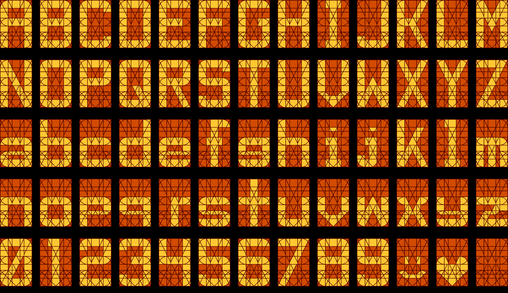
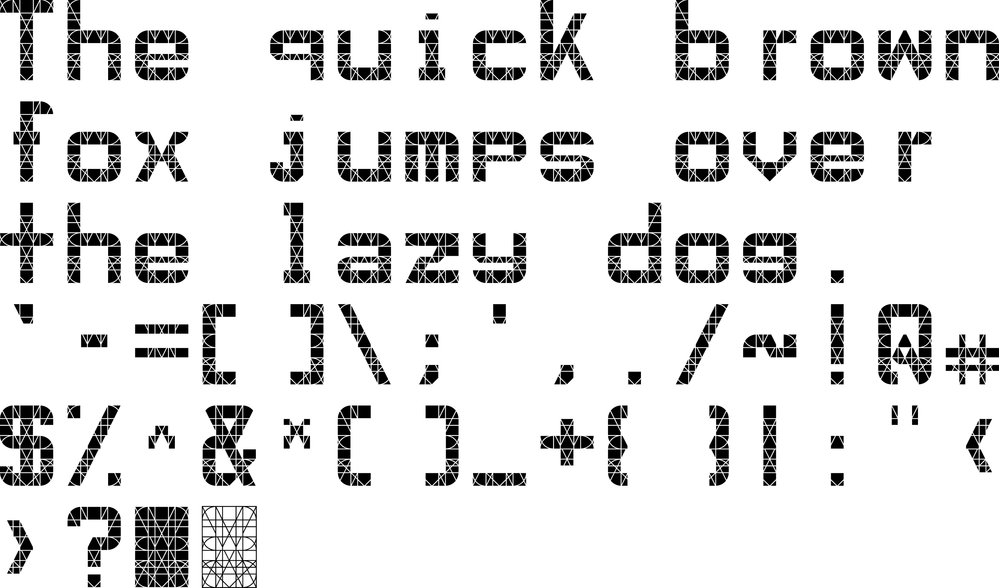

# Transit105
A font based on the 105-segment displays found on NJ Transit trains

List of all characters in the font:
- A–Z
- a–z
- 0–9
- `` `-=[]\;',./~!@#$%^&*()_+{}|:"<>? ``
- em- and en-dashes (— and –)
- ☺ and ♥
- ■ has every segment filled in
- □ has only the outlines of the segments

